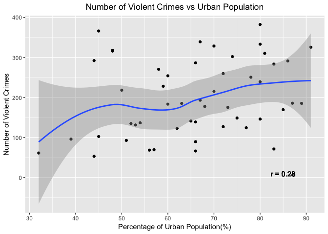
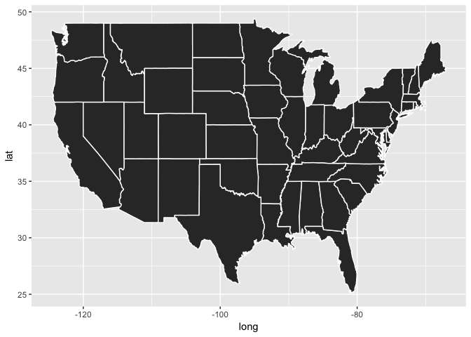
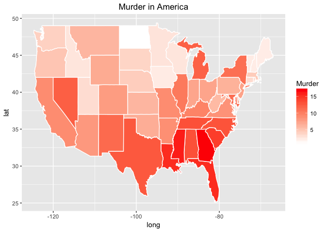
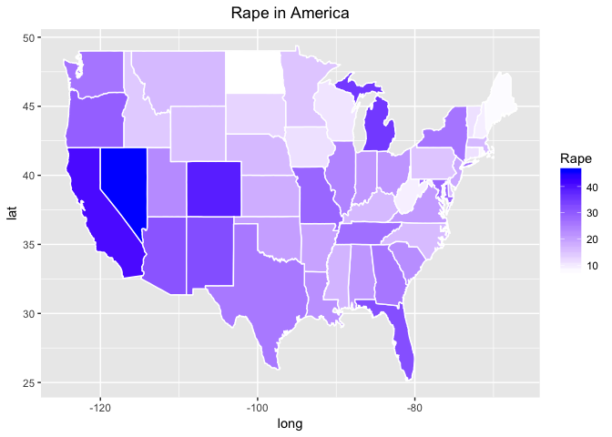
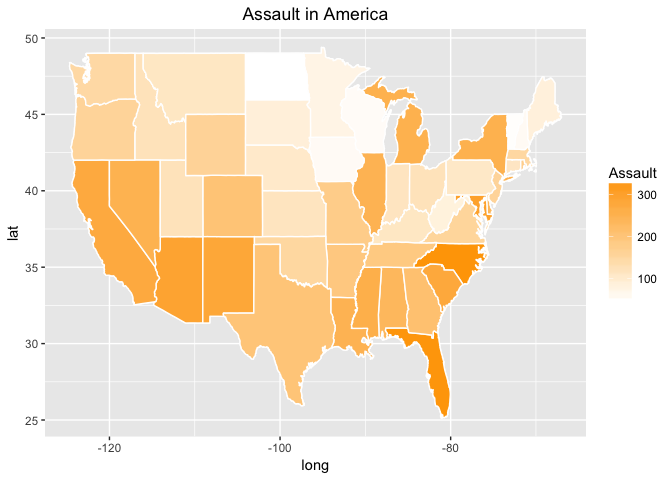

Post 2: Mapping Violent Crimes in America
=========================================

Introduction
------------

Map diagrams have become a popular medium to illustrate data in modern
media. Compelling and vivid, choropleth maps are a great method of data
presentation when conducting analysis of datasets with geometric
significance. Through this post, I would like to utilize the 'maps' and
'ggplot2' packages to generate these maps. This post shows how to use
ggplot to map a choropleth map, changing legend attributes, scale,
color, titles and exporting the map into an image file.

Beyond making maps, the chosen topic is also one of importance. Mapping
the violent crimes in America could potentially lead to observations
that might affect policy. This post contains some elementary statistical
analysis on the topic and a few hypotheses behind them.

### Motivation

"And I'm from the murder capital where they murder for capital" - Kanye
West (From 'Murder to Excellence' by Jay-Z & Kanye West)

That infamous line by Kanye West alludes to his upbringing in Chicago
and the rampant crime rates associated with the city. Upon hearing that
line recently, I thought about the rates of violent crime in the country
and how it would be an interesting topic of research. Through this post,
I will not only be able to verify Kanye's claim about Chicago being the
murder capital but I will also be able to map other violent crimes like
rape and assault. My goals are to hopefully obtain interesting
oberservations about the violent crime rates in the country and also
familliarize myself with the "maps" package.

Content
-------

    library(readr)

    ## Warning: package 'readr' was built under R version 3.2.5

    library(ggplot2)
    library(maps)

    ## Warning: package 'maps' was built under R version 3.2.5

    library(dplyr)

    ## Warning: package 'dplyr' was built under R version 3.2.5

    ## 
    ## Attaching package: 'dplyr'

    ## The following objects are masked from 'package:stats':
    ## 
    ##     filter, lag

    ## The following objects are masked from 'package:base':
    ## 
    ##     intersect, setdiff, setequal, union

### Data

This data set contains statistics, in arrests per 100,000 residents for
assault, murder, and rape in each of the 50 US states in 1973. Also
given is the percent of the population living in urban areas.

    URL <- "https://raw.githubusercontent.com/vincentarelbundock/Rdatasets/master/csv/datasets/USArrests.csv"
    download.file(URL, destfile='crime_data.csv', method = 'curl')
    crimeData <- read.csv('crime_data.csv')
    colnames(crimeData)[1] <-"region"
    head(crimeData)

    ##       region Murder Assault UrbanPop Rape
    ## 1    Alabama   13.2     236       58 21.2
    ## 2     Alaska   10.0     263       48 44.5
    ## 3    Arizona    8.1     294       80 31.0
    ## 4   Arkansas    8.8     190       50 19.5
    ## 5 California    9.0     276       91 40.6
    ## 6   Colorado    7.9     204       78 38.7

### Correlation Between Total Violent Crimes and Urban Population

It seems intuitive to me that crime rates would reduce in urban
environments. My justificaiton for that claim can be broken down into
two arguments. Firstly, any given street is less likely to be empty in a
higher density city. Considering how crime thrives on anonymity, higher
density should result in fewer cases of crimes.

Secondly, if an area has more citizens, it also means that it can also
support a greater police force. Policing efficacy is heavily reliant on
not only the ratio of cops to citizens but also the ratio of cops to
land area. Therefore, it is safe to assume that a denser city would be a
better policed city.

    #Total Number if Violent Crimes in Each State
    crimeData$totalCrime = crimeData$Murder + crimeData$Assault + crimeData$Rape
    crimeData$region = tolower(crimeData$region)
    #Correlation between Total Crime and Percentage of Urban Population
    corr <- round(cor(crimeData$totalCrime, crimeData$UrbanPop),2)

    ggplot(crimeData, aes(x = crimeData$UrbanPop, y = crimeData$totalCrime)) + 
      geom_point() + 
      geom_smooth() + 
      labs(x = "Percentage of Urban Population(%)", y = "Number of Violent Crimes", title = "Number of Violent Crimes vs Urban Population") +
      geom_text(x = 85, y = 10, label = paste("r =", corr)) + 
      theme(plot.title = element_text(hjust = 0.5))

    ## `geom_smooth()` using method = 'loess'

From the scatterplot and correlation coefficient, it is evident that
there isn't a linear correlation between Urban Population and Number of
Violent Crimes. This is expected as the data set has many outliers. This
is because there are many different factors like economic development
and state legislaiton that affects crime rates across different states
in the US that our scatter plot is unable to account for.

One observation that stood out to me was the steep initial increase in
crime as density rises from rural to urban. My initial thoughts on this
was that, because crime relies on anonymity, crimes do not happen as
often in rural areas because the likelihood of being identified is high.

More research and data is required to make any claims and observations
regarding the phenomenon of crime in the US and it's relation to state
density.

Murder Capital of America?
--------------------------

    topMurder <- crimeData$region[crimeData$Murder == max(crimeData$Murder)]
    topRape <- crimeData$region[crimeData$Rape == max(crimeData$Rape)]
    topAssault <- crimeData$region[crimeData$Assault == max(crimeData$Assault)]

Let's begin the mapping process by plotting a basic map of the states in
America. This can be accessed by the built-in "state" dataset in the
maps package.

    usStates <- map_data("state")
    head(usStates)

    ##        long      lat group order  region subregion
    ## 1 -87.46201 30.38968     1     1 alabama      <NA>
    ## 2 -87.48493 30.37249     1     2 alabama      <NA>
    ## 3 -87.52503 30.37249     1     3 alabama      <NA>
    ## 4 -87.53076 30.33239     1     4 alabama      <NA>
    ## 5 -87.57087 30.32665     1     5 alabama      <NA>
    ## 6 -87.58806 30.32665     1     6 alabama      <NA>

Maps can be plotted using the using the polygon geom (using
geom\_ploygon()). geom\_ploygon() essentially draws lines between points
and "closes them up"(i.e. draws a line from the last point back to the
first point).

It's default is a black fill with no line color. I've made the lines
white for clarity.

    #Generates a basic map of 
    baseMap <- ggplot(data = usStates) + 
      geom_polygon(aes(x = long, y = lat, group = group), color = "white")
    baseMap

In order to start plotting information into our map, the datasets need
to be merged by a common variable(I used 'region'). Next, change the
fill of the map to match the density of the variable you would like
plotted. There are many ways to make chloropleth maps in R. Through my
research and experience, I found this to be the easiest.

    #Merging DataSets
    crimeData$region = tolower(crimeData$region)
    mapData <- inner_join(usStates, crimeData, by = 'region')

    #Map of Murder Crimes in America
    mmap <- baseMap + geom_polygon(data = mapData, aes(x = long, y = lat ,group = group,fill = Murder),color = "white") + labs(title= "Murder in America") + theme(plot.title = element_text(hjust = 0.5)) + scale_fill_gradient(low = "white", high = "red")

    mmap

Now that we have the desired map, we can do the same for Rape and
Assault in America.

    #Map of Rape Crimes in America
    rmap <- baseMap + geom_polygon(data = mapData, aes(x = long, y = lat ,group = group,fill = Rape),color = "white") + labs(title= "Rape in America") + theme(plot.title = element_text(hjust = 0.5)) + scale_fill_gradient(low = "white", high = "blue")

    rmap

    #Map of Assault Crimes in America
    amap <- baseMap + geom_polygon(data = mapData, aes(x = long, y = lat ,group = group,fill = Assault),color = "white") + labs(title= "Assault in America") + theme(plot.title = element_text(hjust = 0.5)) + scale_fill_gradient(low = "white", high = "orange")

    amap

Exporting the Map
-----------------

Finally, we will now look into exporting the maps that we have created.
A quick and simple way to do this is via the PDF function.

    pdf("mymap.pdf")
    print(p2)
    dev.off()

Conclusion
----------

The maps generated turned out better than I had expected. Solely using
intuition and observing the maps, some interesting questions arise. Why
are stats with high murder raters predominantly concentrated in the East
Coast? What factors might lead to this? Is it surprising that Nevada
would have the highest rates of reported rape crimes? What makes assault
crimes so rampant in North Carolina?

Simply by looking at the maps, one can come up with many interesting
topics for research. While I am unable to provide a definite answer to
justify these findings, I am still confident that these choropleth maps
serve as a great data visualization tool.

I hope that I have broken down the process of generating maps in R in a
simple and readable manner. I highly encourage generating maps of your
own as it introduces a new perspective.

References
----------

-   Density and Crime -
    <https://www.theatlantic.com/national/archive/2011/05/density-and-crime/238944/>
-   How to make choropleth maps with R -
    <http://bl.ocks.org/prabhasp/raw/5030005/>
-   Mapping with ggplot: Create a nice choropleth map in R -
    <http://rforpublichealth.blogspot.com/2015/10/mapping-with-ggplot-create-nice.html>
-   Package 'choroplethr' CRAN.R-project.org -
    <https://cran.r-project.org/web/packages/choroplethr/choroplethr.pdf>
-   Introduction to visualizing spatial data in R -
    <https://cran.r-project.org/doc/contrib/intro-spatial-rl.pdf>
-   World Map with r? -
    <https://stackoverflow.com/questions/20079308/world-map-with-r>
-   Crime Trends:1990-2016
    -<https://www.brennancenter.org/publication/crime-trends1990-2016>
