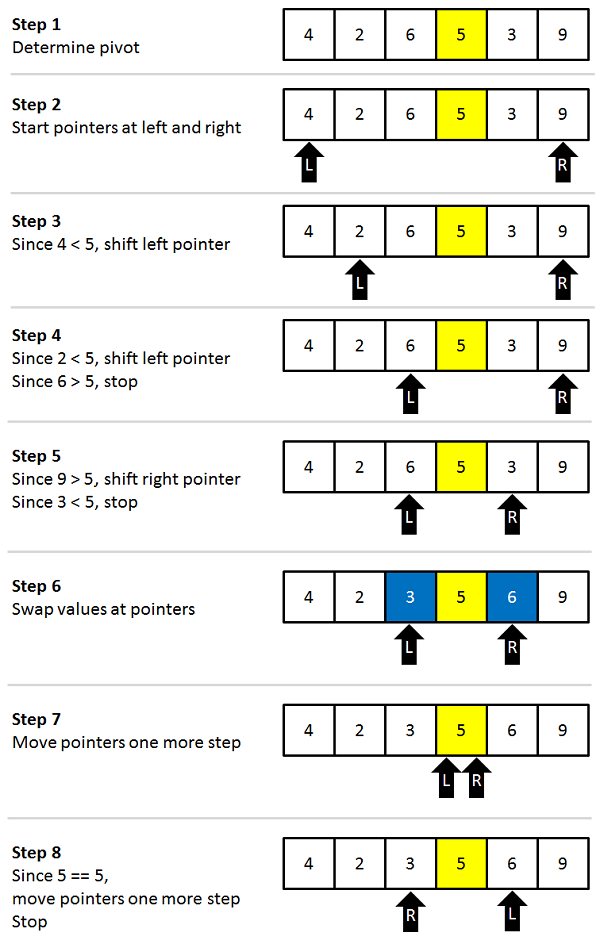

RecursiveSorting-XuBinKuang
================
Xu-Bin Kuang
31/10/2017

Recursion and Sorting Algorithms in R
=====================================

### Introduction

The inspiration behind this post initially came from a youtube video from Ted-Ed titled: [What's the fastest way to alphabetize your bookshelf?](https://www.youtube.com/watch?v=WaNLJf8xzC4)

The problem described in the video is as "You work at the college library. You’re in the middle of a quiet afternoon when suddenly, a shipment of 1,280 books arrives. The books are in a straight line, but they're all out of order, and the automatic sorting system is broken. How can you sort the books quickly? Chand John shows how, shedding light on how algorithms help librarians and search engines speedily sort information."

The video goes over how we'd sort things intuitively, shedding light on how inefficient our traditional sorting methods are. The video ends with a representation of the QuickSort algorithm, a groundbreaking algorithm that has changed the way we compute data. I also learned that it was in interesting application of recursion, a concept that is yet to be introduced in this class but is integral in the field of Computer Science.

### What is Recursion?

In lecture, we have learned various methods of iterating through our data and applying some function to it. Another important concept that does this is recursion. Instead of iterating through an object, recursion relies on the solutions to smaller instances of the same problem to return the main solution to the problem.

This is most simply achieved by allowing a function to call itself within the program text.

#### Structure of a Recursive Function

Recursive functions are simillar to regular functions, they can take in any kind of arguments. The difference is that the function has to call itself.

In addition to that, we need a way to stop the recursive calls. We will call this the 'Base Case'. This is usually the simplest case in which the answer is known (without any recursive calls).

Without the base case, the recursion will not end and run indefinitely.

#### Example of Recursive Function

Let's look at an example to clarify this concept.

Consider Factorials, denoted as n! is the product of all positive integers less than or equal to n.

``` r
3! = 1 * 2 * 3  
```

This can also be represented as

``` r
3! = 3 * 2!
```

Based on that representation, we can generalize factorials to the formula:

``` r
n! = n * (n - 1)!
```

Notice that this continues till n = 0, and that the factorial n! decreases by 1 everytime. Notice that it is a repeated call to factorial, setting this problem up perfectly for a recursive solution!

#### Recursive Solution

``` r
recursiveFactorial = function(n) {
  #Base Case: Stops if n is 0
  if (n == 0) 1 
  
  #The recursive call (n(n-1)!)
  else (n * recursiveFactorial(n -1))
}
```

The function essentially represents the general representation of a factorial. When x = 0, we return 1 since the factorial of 0 is 1. This is our base case.

``` r
recursiveFactorial(1)
```

    ## [1] 1

``` r
recursiveFactorial(5)
```

    ## [1] 120

``` r
recursiveFactorial(100)
```

    ## [1] 9.332622e+157

#### The Quicksort Algorithm

Now that we have an understanding of recursion, we apply our knowledge on a more advanced application, Sorting. Sorting is essential to data scientists and is one of the fundamental problems in the field of Computing.

With this post, I intend to introduce the concept of Quicksort and how we can utlize the concept of recursion to implement it

Quicksort first divides a large array into two smaller sub-arrays: the low elements and the high elements. Quicksort can then recursively sort the sub-arrays.

The steps are as follows:

-   Pick an element as the pivot, from an array.
-   Partitioning: reorder the array so that all elements with values less than the pivot come before the pivot, while all elements with values greater than the pivot come after it (equal values can go either way). After this partitioning, the pivot is in its final position. This is called the partition operation.
-   Recursively apply the above steps to the sub-array of elements with smaller values and separately to the sub-array of elements with greater values.
-   The base case of the recursion is arrays of size zero or one, which are in order by definition, so they never need to be sorted.



Based on the diagram we can see than 5 is the pivot value. Next, starting with the left pointer at position 1 in the right pointer at position 5 (last item in the array). Since 4 is less than 5, move the left pointer to position 1. Since 2 is less than 5, move the left pointer to position 2. Now 6 is not less than 5, so the left pointer stops moving and the right pointer value is compared to the pivot. Since 9 is greater than 5, the right pointer is moved to position 4. The value 3 is not greater than 5, so the right pointer stops. Since the left pointer is at position 2 and the right pointer is at position 4, the two haven’t met and the values 6 and 3 should be swapped.

Next, the left pointer is increased by one in the right pointer is decreased by one. This results in both pointers at the pivot value (5). That signals that the operation is complete. Now all items in the array to the left of the pivot are less than the pivot and all items to the right of the pivot are greater than the pivot. Keep in mind that this doesn’t mean the array is sorted right now, only that there are two sections of the array: the section where all values are less than the pivot and the section were all values are greater than the pivot.

#### QuickSort Function in R

``` r
quickSort <- function(vect) {
  # Args:
  #  vect: Numeric Vector
  
  # Stop if vector has length of 1
  if (length(vect) <= 1) {
      return(vect)
  }
  # Pick an element from the vector
  element <- vect[1]
  partition <- vect[-1]
  # Reorder vector so that integers less than element
  # come before, and all integers greater come after.
  
  v1 <- partition[partition < element]
  v2 <- partition[partition >= element]
  
  # Recursively apply steps to smaller vectors.
  v1 <- quickSort(v1)
  v2 <- quickSort(v2)
  return(c(v1, element, v2))
}
```

Now we get to see our new quickSort function in action!

``` r
quickSort(c(4, 65, 2, -31, 0, 99, 83, 782, 1))
```

    ## [1] -31   0   1   2   4  65  83  99 782

### Final Message

The Quick Sort algorithm is used across the industry because it is faster and requires less computing time than traditional sorting algorithms like bubble sort and insert sort. It is interesting to think that how most ordered things online utilize this algorithm or some other efficient recursive algorithm like Merge Sort.

Reflecting on this, it really sheds light on the ingenuity behind the human implementations of a simple yet undoubtedly powerful computing concept like Recursion.

### References:

Computer Science in JavaScript: Quicksort - <https://www.nczonline.net/blog/2012/11/27/computer-science-in-javascript-quicksort/>

Algorithms: QuickSort - <https://www.youtube.com/watch?v=SLauY6PpjW4>

Merge Sort and QuickSort, Princeton - <http://www.cs.princeton.edu/courses/archive/spr07/cos226/lectures/04MergeQuick.pdf>

QuickSort Wikipedia - <https://en.wikipedia.org/wiki/Quicksort>

Overview of QuickSort(Khan Academy) - <https://www.khanacademy.org/computing/computer-science/algorithms/quick-sort/a/overview-of-quicksort>

Recursion (Wikipedia) - <https://en.wikipedia.org/wiki/Recursion_(computer_science)>

Recursive Functions in R - <https://www.tutorialgateway.org/recursive-functions-in-r/>
