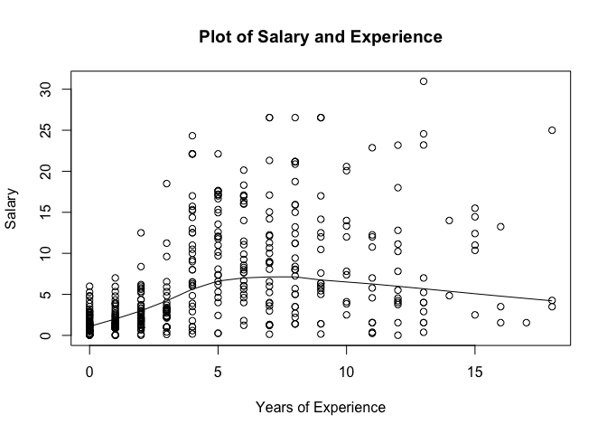

hw01-Jonathan-Kuang
================
Xu-Bin Kuang
23/09/2017

``` r
load("data/nba2017-salary-points.RData")
```

``` r
salary = salary/1000000
```

``` r
salary = round(salary, 2)
```

``` r
experience[experience == "R"] <- 0
```

``` r
experience <- as.numeric(experience)
```

``` r
position <- as.factor(position)
```

``` r
levels(position)[1] = "center"
levels(position)[2] = "power_fwd"
levels(position)[3] = "point_guard"
levels(position)[4] = "small_fwd"
levels(position)[5] = "shoot_guard"
```

``` r
table(position)
```

    ## position
    ##      center   power_fwd point_guard   small_fwd shoot_guard 
    ##          89          89          85          83          95

``` r
plot(points, salary, main = "Scatterplot of Points and Salary", xlab = "Points", ylab = "Salary", col = "blue", cex.main = 2, cex.axis = 1, cex.lab = 1)
```


``` r
n <- length(position)
meanSalary <- sum(salary)/n
meanPoints <- sum(points)/n
varSalary <- (1/(n-1)) * (sum((meanSalary - salary)^2))
varPoints <- (1/(n-1)) * (sum((meanPoints - points)^2))
sdSalary <- sqrt(varSalary)
sdPoints <- sqrt(varPoints)
covSalaryPoints <- (1/(n-1)) * (sum((meanPoints - points) * (meanSalary - salary)))
corSalaryPoints <- covSalaryPoints/((sdSalary) * (sdPoints))
```

``` r
slope <-corSalaryPoints * ((sdSalary)/(sdPoints))
intercept <- meanSalary - slope * meanPoints
yHat = intercept - slope * points
yHatFunc = function(point)
  intercept - slope * point
```

``` r
summary(yHat)
```

    ##     Min.  1st Qu.   Median     Mean  3rd Qu.     Max. 
    ## -20.3800  -5.1660  -2.1880  -3.1690   0.1741   1.5090

``` r
RegressionEquation = 1.509077 - 0.008557567 * points
yHatFunc(0)
```

    ## [1] 1.509077

``` r
yHatFunc(100)
```

    ## [1] 0.6533199

``` r
yHatFunc(500)
```

    ## [1] -2.769707

``` r
yHatFunc(1000)
```

    ## [1] -7.04849

``` r
yHatFunc(2000)
```

    ## [1] -15.60606

The slope coefficient usually refers to the coefficient of any independent variable, x, in a regression equation. It tells the amount of change in y that can be expected to result from a unit increase in x.

The intercept (often labeled the constant) is the expected mean value of Y when all X=0.

``` r
plot(points, salary, main = "Plot of Salary and Points", xlab = "Points", ylab = "Salary")
abline(a = intercept, b = slope, col = "red")
lines(lowess(points, salary, f = 2/3, iter = 3))
```


``` r
residual <-  salary - yHat
summary(residual)
```

    ##    Min. 1st Qu.  Median    Mean 3rd Qu.    Max. 
    ##  -1.479   2.069   6.302   9.355  13.610  46.920

``` r
RSS <- sum((residual)^2)
TSS <- sum((salary - meanSalary)^2)
R_2 <- 1 - (RSS/TSS)
```

``` r
plot(experience, salary, main = "Plot of Salary and Experience", xlab = "Years of Experience", ylab = "Salary")
lines(lowess(experience, salary, f = 2/3, iter = 3))
```



``` r
library(scatterplot3d)
```

    ## Warning: package 'scatterplot3d' was built under R version 3.2.5

``` r
scatterplot3d(points, experience, salary,color = "gold", main = "3D Scatterplot" )
```


``` r
boxplot(salary~position, varwidth = TRUE,
  col=(c("gold","darkgreen")),
  main="Salary vs Position", xlab="Positions", ylab = "Salary(in millions)", xact = "n")

axis(1, labels=c("point_guard", "shoot_guard"), at= c(3,5), las=1)
```


