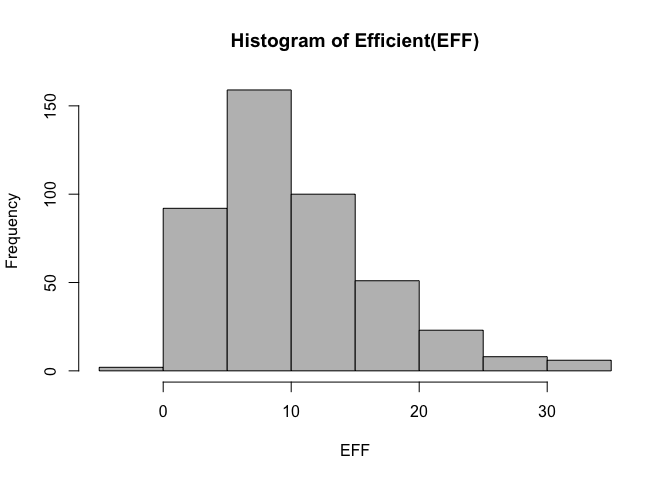

hw2-XuBin-Kuang
================
Xu-Bin Kuang
01/10/2017

``` r
github <- "https://github.com/ucb-stat133/stat133-fall-2017/raw/master/" 
file <- "data/nba2017-player-statistics.csv"
csv <- paste0(github, file)
download.file(url = csv, destfile = 'nba2017-player-statistics.csv')
```

``` r
DataBase <- data.frame(read.csv(csv, header = TRUE, colClasses=c("Player"="character", "Team" = "character", "Experience" = "character", "Position" = "factor", "Salary" = 'double')))
str(DataBase)
```

    ## 'data.frame':    441 obs. of  24 variables:
    ##  $ Player      : chr  "Al Horford" "Amir Johnson" "Avery Bradley" "Demetrius Jackson" ...
    ##  $ Team        : chr  "BOS" "BOS" "BOS" "BOS" ...
    ##  $ Position    : Factor w/ 5 levels "C","PF","PG",..: 1 2 5 3 4 3 4 5 4 2 ...
    ##  $ Experience  : chr  "9" "11" "6" "R" ...
    ##  $ Salary      : num  26540100 12000000 8269663 1450000 1410598 ...
    ##  $ Rank        : int  4 6 5 15 11 1 3 13 8 10 ...
    ##  $ Age         : int  30 29 26 22 31 27 26 21 20 29 ...
    ##  $ GP          : int  68 80 55 5 47 76 72 29 78 78 ...
    ##  $ GS          : int  68 77 55 0 0 76 72 0 20 6 ...
    ##  $ MIN         : int  2193 1608 1835 17 538 2569 2335 220 1341 1232 ...
    ##  $ FGM         : int  379 213 359 3 95 682 333 25 192 114 ...
    ##  $ FGA         : int  801 370 775 4 232 1473 720 58 423 262 ...
    ##  $ Points3     : int  86 27 108 1 39 245 157 12 46 45 ...
    ##  $ Points3_atts: int  242 66 277 1 111 646 394 35 135 130 ...
    ##  $ Points2     : int  293 186 251 2 56 437 176 13 146 69 ...
    ##  $ Points2_atts: int  559 304 498 3 121 827 326 23 288 132 ...
    ##  $ FTM         : int  108 67 68 3 33 590 176 6 85 26 ...
    ##  $ FTA         : int  135 100 93 6 41 649 217 9 124 37 ...
    ##  $ OREB        : int  95 117 65 2 17 43 48 6 45 60 ...
    ##  $ DREB        : int  369 248 269 2 68 162 367 20 175 213 ...
    ##  $ AST         : int  337 140 121 3 33 449 155 4 64 71 ...
    ##  $ STL         : int  52 52 68 0 9 70 72 10 35 26 ...
    ##  $ BLK         : int  87 62 11 0 7 13 23 2 18 17 ...
    ##  $ TO          : int  116 77 88 0 25 210 79 4 68 39 ...

``` r
library(readr)
```

    ## Warning: package 'readr' was built under R version 3.2.5

``` r
DataReadr <- read_csv(csv, col_types = cols(.default = col_integer(),Player = col_character(), Team = col_character(), Position = col_factor(c('C','PF','PG','SF','SG')), Experience = col_character(), Salary = col_double()))
```

    ## `curl` package not installed, falling back to using `url()`

``` r
str(DataReadr)
```

    ## Classes 'tbl_df', 'tbl' and 'data.frame':    441 obs. of  24 variables:
    ##  $ Player      : chr  "Al Horford" "Amir Johnson" "Avery Bradley" "Demetrius Jackson" ...
    ##  $ Team        : chr  "BOS" "BOS" "BOS" "BOS" ...
    ##  $ Position    : Factor w/ 5 levels "C","PF","PG",..: 1 2 5 3 4 3 4 5 4 2 ...
    ##  $ Experience  : chr  "9" "11" "6" "R" ...
    ##  $ Salary      : num  26540100 12000000 8269663 1450000 1410598 ...
    ##  $ Rank        : int  4 6 5 15 11 1 3 13 8 10 ...
    ##  $ Age         : int  30 29 26 22 31 27 26 21 20 29 ...
    ##  $ GP          : int  68 80 55 5 47 76 72 29 78 78 ...
    ##  $ GS          : int  68 77 55 0 0 76 72 0 20 6 ...
    ##  $ MIN         : int  2193 1608 1835 17 538 2569 2335 220 1341 1232 ...
    ##  $ FGM         : int  379 213 359 3 95 682 333 25 192 114 ...
    ##  $ FGA         : int  801 370 775 4 232 1473 720 58 423 262 ...
    ##  $ Points3     : int  86 27 108 1 39 245 157 12 46 45 ...
    ##  $ Points3_atts: int  242 66 277 1 111 646 394 35 135 130 ...
    ##  $ Points2     : int  293 186 251 2 56 437 176 13 146 69 ...
    ##  $ Points2_atts: int  559 304 498 3 121 827 326 23 288 132 ...
    ##  $ FTM         : int  108 67 68 3 33 590 176 6 85 26 ...
    ##  $ FTA         : int  135 100 93 6 41 649 217 9 124 37 ...
    ##  $ OREB        : int  95 117 65 2 17 43 48 6 45 60 ...
    ##  $ DREB        : int  369 248 269 2 68 162 367 20 175 213 ...
    ##  $ AST         : int  337 140 121 3 33 449 155 4 64 71 ...
    ##  $ STL         : int  52 52 68 0 9 70 72 10 35 26 ...
    ##  $ BLK         : int  87 62 11 0 7 13 23 2 18 17 ...
    ##  $ TO          : int  116 77 88 0 25 210 79 4 68 39 ...
    ##  - attr(*, "spec")=List of 2
    ##   ..$ cols   :List of 24
    ##   .. ..$ Player      : list()
    ##   .. .. ..- attr(*, "class")= chr  "collector_character" "collector"
    ##   .. ..$ Team        : list()
    ##   .. .. ..- attr(*, "class")= chr  "collector_character" "collector"
    ##   .. ..$ Position    :List of 3
    ##   .. .. ..$ levels    : chr  "C" "PF" "PG" "SF" ...
    ##   .. .. ..$ ordered   : logi FALSE
    ##   .. .. ..$ include_na: logi FALSE
    ##   .. .. ..- attr(*, "class")= chr  "collector_factor" "collector"
    ##   .. ..$ Experience  : list()
    ##   .. .. ..- attr(*, "class")= chr  "collector_character" "collector"
    ##   .. ..$ Salary      : list()
    ##   .. .. ..- attr(*, "class")= chr  "collector_double" "collector"
    ##   .. ..$ Rank        : list()
    ##   .. .. ..- attr(*, "class")= chr  "collector_integer" "collector"
    ##   .. ..$ Age         : list()
    ##   .. .. ..- attr(*, "class")= chr  "collector_integer" "collector"
    ##   .. ..$ GP          : list()
    ##   .. .. ..- attr(*, "class")= chr  "collector_integer" "collector"
    ##   .. ..$ GS          : list()
    ##   .. .. ..- attr(*, "class")= chr  "collector_integer" "collector"
    ##   .. ..$ MIN         : list()
    ##   .. .. ..- attr(*, "class")= chr  "collector_integer" "collector"
    ##   .. ..$ FGM         : list()
    ##   .. .. ..- attr(*, "class")= chr  "collector_integer" "collector"
    ##   .. ..$ FGA         : list()
    ##   .. .. ..- attr(*, "class")= chr  "collector_integer" "collector"
    ##   .. ..$ Points3     : list()
    ##   .. .. ..- attr(*, "class")= chr  "collector_integer" "collector"
    ##   .. ..$ Points3_atts: list()
    ##   .. .. ..- attr(*, "class")= chr  "collector_integer" "collector"
    ##   .. ..$ Points2     : list()
    ##   .. .. ..- attr(*, "class")= chr  "collector_integer" "collector"
    ##   .. ..$ Points2_atts: list()
    ##   .. .. ..- attr(*, "class")= chr  "collector_integer" "collector"
    ##   .. ..$ FTM         : list()
    ##   .. .. ..- attr(*, "class")= chr  "collector_integer" "collector"
    ##   .. ..$ FTA         : list()
    ##   .. .. ..- attr(*, "class")= chr  "collector_integer" "collector"
    ##   .. ..$ OREB        : list()
    ##   .. .. ..- attr(*, "class")= chr  "collector_integer" "collector"
    ##   .. ..$ DREB        : list()
    ##   .. .. ..- attr(*, "class")= chr  "collector_integer" "collector"
    ##   .. ..$ AST         : list()
    ##   .. .. ..- attr(*, "class")= chr  "collector_integer" "collector"
    ##   .. ..$ STL         : list()
    ##   .. .. ..- attr(*, "class")= chr  "collector_integer" "collector"
    ##   .. ..$ BLK         : list()
    ##   .. .. ..- attr(*, "class")= chr  "collector_integer" "collector"
    ##   .. ..$ TO          : list()
    ##   .. .. ..- attr(*, "class")= chr  "collector_integer" "collector"
    ##   ..$ default: list()
    ##   .. ..- attr(*, "class")= chr  "collector_integer" "collector"
    ##   ..- attr(*, "class")= chr "col_spec"

``` r
DataBase$Experience <- replace(as.character(DataBase$Experience), DataBase$Experience == "R", 0)
DataBase$Experience = as.integer(DataBase$Experience)
```

``` r
DataBase$Missed_FG = DataBase$FGA - DataBase$FGM
DataBase$Missed_FT = DataBase$FTA - DataBase$FTM
DataBase$PTS = 2 * DataBase$Points2 + 3 * DataBase$Points3 + DataBase$FTM
DataBase$REB = DataBase$OREB + DataBase$DREB
DataBase$MPG = DataBase$MIN/DataBase$GP
```

``` r
DataBase$EFF = (DataBase$PTS + DataBase$REB + DataBase$AST + DataBase$STL + DataBase$BLK - DataBase$Missed_FG - DataBase$Missed_FT - DataBase$TO) / DataBase$GP

summary(DataBase$EFF)
```

    ##    Min. 1st Qu.  Median    Mean 3rd Qu.    Max. 
    ##  -0.600   5.452   9.090  10.140  13.250  33.840

``` r
hist(DataBase$EFF, xlab = "EFF", main = "Histogram of Efficient(EFF)", col = "gray")
```



``` r
#Top 10 EFF
library(dplyr)
```

    ## Warning: package 'dplyr' was built under R version 3.2.5

    ## 
    ## Attaching package: 'dplyr'

    ## The following objects are masked from 'package:stats':
    ## 
    ##     filter, lag

    ## The following objects are masked from 'package:base':
    ## 
    ##     intersect, setdiff, setequal, union

``` r
Top = arrange(DataBase, desc(EFF))
```

    ## Warning: package 'bindrcpp' was built under R version 3.2.5

``` r
Top = slice(Top, 1:10)
Top = select(Top, Player, Team, Salary, EFF)
```

``` r
#Players with Negative EFF
DataBase$Player[DataBase$EFF < 0]
```

    ## [1] "Patricio Garino"

``` r
#Computed Correlations
corr_coff <- c(cor(DataBase$EFF, DataBase$PTS), cor(DataBase$EFF, DataBase$REB), cor(DataBase$EFF, DataBase$AST), cor(DataBase$EFF, DataBase$STL), cor(DataBase$EFF, DataBase$BLK), cor(DataBase$EFF, -DataBase$Missed_FG), cor(DataBase$EFF, -DataBase$Missed_FT), cor(DataBase$EFF, -DataBase$TO))

barplot(corr_coff, main = "Correlations between Player Stats and EFF", names.arg = c("PTS", "REB", "STL", "AST", "BLK", "Missed_FT", "Missed_FG", "TO"), ylim=c(-1,1), col = c("gray", "gray", "gray", "gray", "gray", "red", "red", "red") )
abline( h = 0)
```


``` r
#Efficiency and Salary
plot(DataBase$EFF, DataBase$Salary, main = "Plot of Efficiency and Salary", xlab = "Efficiency", ylab = "Salary")
lines(lowess(DataBase$EFF, DataBase$Salary, f = 2/3, iter = 3))
```


``` r
corr = cor(DataBase$EFF, DataBase$Salary)
corr
```

    ## [1] 0.655624

``` r
#Since corr is > 0, there's a positive correlation between Efficiency and Salary. The lowess line is less steep in the beginning, indicating that at lower levels of efficiency, slight increases in efficicenty corresponds with a low change in salary. However, above an EFF score of 15, the change looks to be proportional as shown by the steep lowess line. This could be because this me
```

``` r
players2 <- data.frame(subset(DataBase, DataBase$MPG >= 20))
plot(players2$EFF, players2$Salary, main = "Plot of Efficiency and Salary", xlab = "Efficiency", ylab = "Salary")
lines(lowess(players2$EFF, players2$Salary, f = 2/3, iter = 3))
```


``` r
corr = cor(players2$EFF, players2$Salary)
corr
```

    ## [1] 0.5367224

``` r
#The correlation is lower for more established players because there is a better track record for teams to decide on after rookies have been removed. 
```
