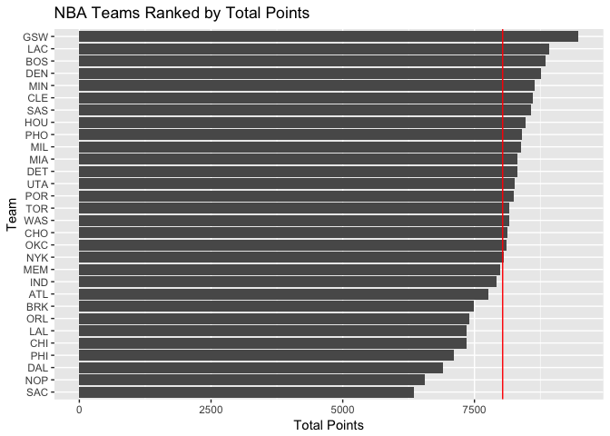
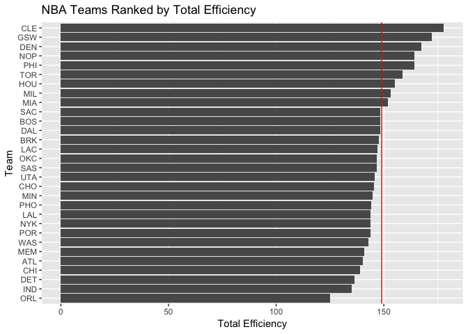
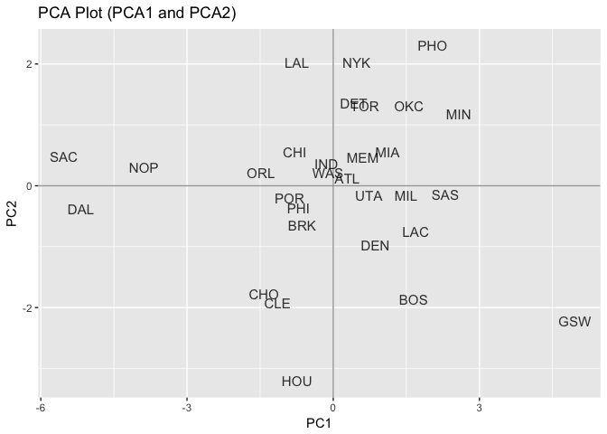
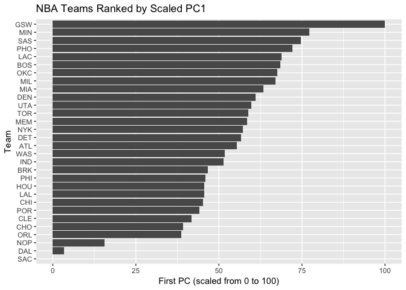

hw03-xubin-kuang
================
Xu-Bin Kuang
15/10/2017

``` r
# packages
library(readr)    # importing data
```

    ## Warning: package 'readr' was built under R version 3.2.5

``` r
library(dplyr)    # data wrangling
```

    ## Warning: package 'dplyr' was built under R version 3.2.5

    ## 
    ## Attaching package: 'dplyr'

    ## The following objects are masked from 'package:stats':
    ## 
    ##     filter, lag

    ## The following objects are masked from 'package:base':
    ## 
    ##     intersect, setdiff, setequal, union

``` r
library(ggplot2)  # graphics
```

    ## Warning: package 'ggplot2' was built under R version 3.2.5

``` r
# import data
teams <- read_csv("../data/nba2017-teams.csv")
```

    ## Warning: Missing column names filled in: 'X1' [1]

    ## Parsed with column specification:
    ## cols(
    ##   X1 = col_integer(),
    ##   team = col_character(),
    ##   experience = col_integer(),
    ##   salary = col_double(),
    ##   points3 = col_integer(),
    ##   points2 = col_integer(),
    ##   free_throws = col_integer(),
    ##   points = col_integer(),
    ##   off_rebounds = col_integer(),
    ##   def_rebounds = col_integer(),
    ##   assists = col_integer(),
    ##   steals = col_integer(),
    ##   blocks = col_integer(),
    ##   turnovers = col_integer(),
    ##   fouls = col_integer(),
    ##   efficiency = col_double()
    ## )

``` r
ggplot(teams, aes(x = reorder(team, salary), y=salary)) +
  geom_bar(stat='identity') +
  coord_flip() +
  labs(x = "Team", y = "Salary (in millions)", 
       title = "NBA Teams Ranked by Total Salary") +
  geom_hline(yintercept = mean(teams$salary), color='red')
```


The Warriors score the most total points with roughly 8,500 points in total. The average number of points for all other teams is around 7,700 points.

``` r
ggplot(teams, aes(x = reorder(team, points), y=points)) +
  geom_bar(stat='identity') +
  coord_flip() +
  labs(x = "Team", y = "Total Points", 
       title = "NBA Teams Ranked by Total Points") +
  geom_hline(yintercept = mean(teams$points), color='red')
```



Finally, we *rank by team efficiency.* The Warriors and the Cavaliers lead the league in terms of effcienc.

``` r
ggplot(teams, aes(x = reorder(team, efficiency), y=efficiency)) +
  geom_bar(stat='identity') +
  coord_flip() +
  labs(x = "Team", y = "Total Efficiency", 
       title = "NBA Teams Ranked by Total Efficiency") +
  geom_hline(yintercept = mean(teams$efficiency), color='red')
```



### Principal Components Analsysis (PCA).

``` r
# data frame with eigenvalues
pca_vars <- select(teams, points3, points2, free_throws, off_rebounds, def_rebounds, assists, steals,
                   blocks, turnovers, fouls)
pca <- prcomp(pca_vars, scale. = TRUE)
eigen <- data.frame(eigenvalue = round(pca$sdev^2,4), prop = round(pca$sdev^2 / sum(pca$sdev^2), 4))
eigen$cumprop <- cumsum(eigen$prop)
eigen
```

    ##    eigenvalue   prop cumprop
    ## 1      4.6959 0.4696  0.4696
    ## 2      1.7020 0.1702  0.6398
    ## 3      0.9795 0.0980  0.7378
    ## 4      0.7717 0.0772  0.8150
    ## 5      0.5341 0.0534  0.8684
    ## 6      0.4780 0.0478  0.9162
    ## 7      0.3822 0.0382  0.9544
    ## 8      0.2603 0.0260  0.9804
    ## 9      0.1336 0.0134  0.9938
    ## 10     0.0627 0.0063  1.0001

*Plot PC1 and PC2.*

``` r
# create another df
pca_df = as.data.frame(pca$x)
rownames(pca_df) <- teams$team
# head(pca_df)

# plot of observations
ggplot(data = pca_df, aes(x = PC1, y = PC2, label = rownames(pca_df))) +
  geom_hline(yintercept = 0, colour = "gray65") +
  geom_vline(xintercept = 0, colour = "gray65") +
  geom_text(colour = "black", alpha = 0.8, size = 4) +
  ggtitle("PCA Plot (PCA1 and PCA2)")
```



``` r
#plot(pca$PC1, pca$PC2)
```

*Transform PC1.*

``` r
transformed_PC1 <- 100 * ((pca_df$PC1 - min(pca_df$PC1)) / (max(pca_df$PC1) - min(pca_df$PC1)))
transformed_PC1
```

    ##  [1]  55.471897  68.432930  46.640314  45.199683  39.169120  41.824445
    ##  [7]   3.357322  60.950042  56.754305 100.000000  45.633232  51.394292
    ## [13]  68.862721  45.619512  58.511713  63.359160  66.968243  77.280477
    ## [19]  15.660728  57.304183  67.554140  38.580520  45.905162  72.163434
    ## [25]  44.174106   0.000000  74.645300  58.891926  59.690765  51.680440

*Plot with new PC1 (scaled from 0 to 100).* GSW is clearly the top team based on PCA with the Sacramento Kings being the worst

``` r
ggplot(teams, aes(x = reorder(team, transformed_PC1), y=transformed_PC1)) +
  geom_bar(stat='identity') +
  coord_flip() +
  labs(x = "Team", y = "First PC (scaled from 0 to 100)", 
       title = "NBA Teams Ranked by Scaled PC1")
```


